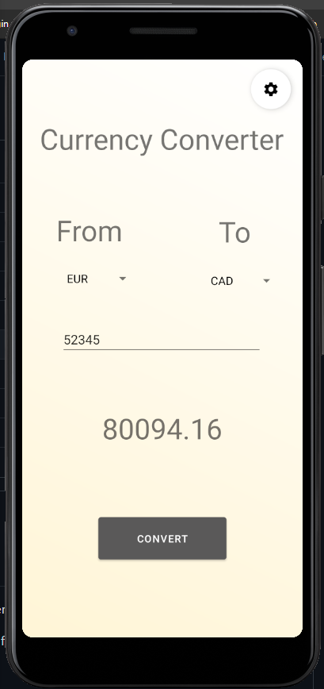
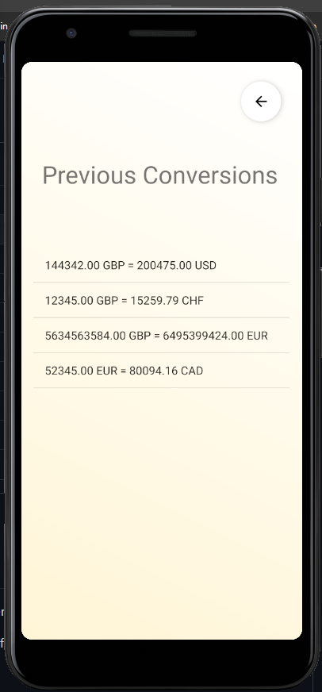

# CurrencyConverter
A simple currency converter android app. This will have been my first app so it's just for fun.

The app allows users to select a currency to convert to and from, and displays previous conversions on a seperate page.

This app was made in Android Studio using Java. Making it, I learned about multiple activites, internal storage,
drop down menus, spinners, and styling Android components (I'm **--definitely--** not a graphic designer though so take the look with a grain of salt)

## Main Page:

## Previous Conversions Page:

